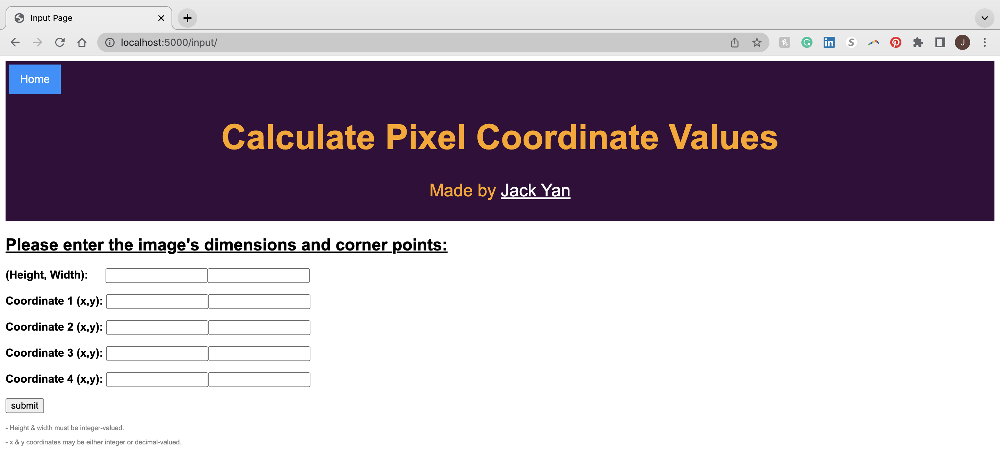
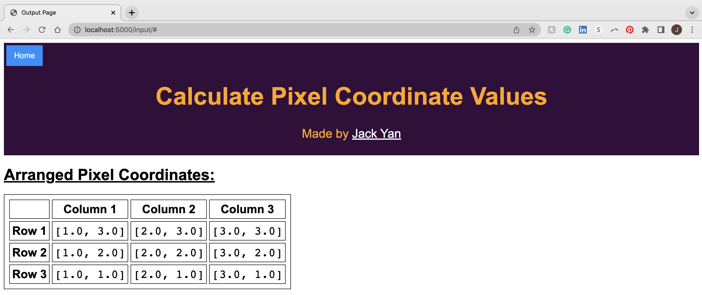

# calculate_pixel_coordinates

A program that calculates pixel coordinate values for an image that is to be displayed on a two dimensional surface given the dimensions of the image and the corner points of the image.

## Dependencies

* [Docker Destop](https://www.docker.com/products/docker-desktop/)
* [Python 3](https://www.python.org/)

## Running the application

* After downloading the "calculate_pixel_coordinates" repository, navigate to the working directory where repository is locally saved.

### Activate the virtual environment

```
source venv/bin/activate
```

### Build the Docker Image

```
docker build --tag python-docker .
```

### Run the Docker Image as a Container

```
docker run -d -p 5000:5000 python-docker
```

### Start the web application

* In your favorite browser, visit localhost at port 5000:
```
localhost:5000
```
* Your browser should now display the web application's home page


## Using the web application

* Click the "Go to Input Page" to navigate to the Input Page



* After entering the inputs and clicking "submit", the web application will navigate to the output page reporting the coordinates of all pixels
  * The image below shows example output for a rectangle with 3 pixels height and 3 pixels width with corner points: (1, 1), (1, 3), (3, 1), and (3, 3)



### Help

*  The "Home" button on every page will return the user to the Home Page
*  If the inputs are malformed, the "submit" button will return the user to the Input Page
 *  

## Author

[Jack Yan](https://www.linkedin.com/in/yan-jack/)
